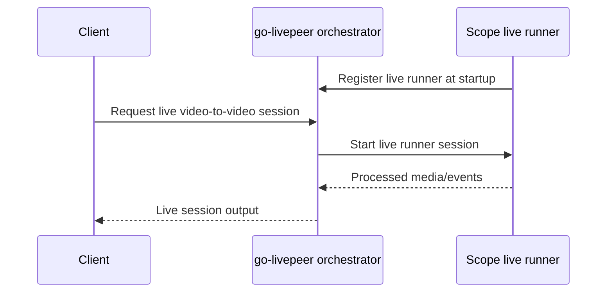

# Running Scope on the Livepeer public network

This Docker Compose bundle runs Scope as a Live Runner behind an orchestrator,
with Caddy handling public TLS and Watchtower keeping container images current.

This differs from earlier orchestrator configurations in that the orchestrator
now requires a functioning SSL endpoint for live runner traffic. This example
includes Caddy which can acquire certificates automatically and handle renewals
without a separate TLS service.

Cloudflare Tunnels are not recommended for this setup due to the buffering
(latency) they introduce.

Scope instances register with the orchestrator at runtime. The orchestrator
advertises the runner’s capabilities and routes sessions to it.




## For Agents (Claude / Codex)

If you are an AI agent deploying or validating this stack, read
`skills/deploying-scope-public-orchestrator/SKILL.md`. It encodes the deploy
steps plus an ordered, runnable validation that proves the orchestrator is
*actually* serving video — not just registered and discoverable. A Scope runner
can register, advertise capacity, and bill while producing zero frames, so the
skill calls out those false-green signals and the common failure modes.

## Files

- `docker-compose.yml` runs Scope, go-livepeer, Caddy, and Watchtower.
- `env.example` lists required runtime configuration.
- `go-livepeer.conf.template` is the single source of truth for the
  orchestrator config. It is rendered into `/tmp/go-livepeer.conf` inside the
  go-livepeer container at startup, and then `livepeer -config` runs that
  rendered file.
- `Caddyfile` terminates TLS for `DOMAIN` and proxies to go-livepeer.

## Setup

1. Copy the example environment and edit the values:

   ```bash
   cp env.example .env
   ```

2. Point DNS for `DOMAIN` at the Docker host and make sure ports `80` and `443`
   are reachable from the public internet.

3. Put the Livepeer Ethereum keystore and password file in the persistent
   `livepeer-data` volume. The defaults expect:

   ```text
   /root/.lpData/arbitrum-one-mainnet/keystore
   /root/.lpData/.eth_secret
   ```

## Secrets And Persistent Data

- The Compose file does not create the Livepeer keystore or `.eth_secret` for
  you. Those must already exist before `go-livepeer` starts.
- By default, `go-livepeer` reads both from the persistent `livepeer-data`
  volume mounted at `/root/.lpData`.
- Scope keeps shared runner data in the persistent `scope-shared-data` volume
  mounted at `/workspace/shared`. This is where model weights and shared LoRAs
  live across container restarts and replacements.
- Scope keeps per-session assets, logs, and plugins under
  `/tmp/.daydream-scope/assets` inside the container. That session data is
  intentionally ephemeral.
- If you already manage these files on the host, you can replace the named
  volume with bind mounts and point `ETH_KEYSTORE_PATH` / `ETH_PASSWORD_FILE`
  at those mounted paths instead.
- If you keep the named volume, populate it before first startup, for example
  by copying the keystore directory and `.eth_secret` into the volume with a
  one-off container or temporary mount.
- Keep the password file readable by the `go-livepeer` process inside the
  container and avoid storing either secret in the repo or other ephemeral
  container filesystems.

4. Validate the Compose file:

   ```bash
   docker compose config
   ```

5. Start the stack:

   ```bash
   docker compose up -d
   ```

6. Make sure Docker itself starts on boot on the host. On Linux hosts this
   usually means enabling the Docker service with:

   ```bash
   sudo systemctl enable docker
   sudo systemctl start docker
   ```

   On Docker Desktop, enable the setting to start Docker when the host logs in.
   The Compose services already use `restart: unless-stopped`, so once the
   Docker daemon comes back after a reboot, the stack will come back
   automatically.


## Scope Artifact Prefetch

The `scope-live-runner` service prefetches Scope model artifacts and promoted
starter LoRAs before it registers with go-livepeer. This keeps the first live
session from paying the download cost. Prefetched files are stored in the
persistent `scope-shared-data` volume under `/workspace/shared/models`, including
shared LoRAs under `/workspace/shared/models/lora`, so container restarts and
Watchtower image replacements reuse the cached artifacts.

Use `DOWNLOAD_MODELS` to override the default space-separated pipeline list. Use
`DOWNLOAD_LORAS` to override the default line-oriented LoRA list; each non-empty
line is passed as arguments to `uv run download_loras`, so include `--url`, `--filename`, and,
when available, `--expected-sha256`. Text after `#` is treated as a human label.
Set either variable to an empty value to skip that prefetch category.

For example:

```env
DOWNLOAD_MODELS=longlive rife
DOWNLOAD_LORAS='--url https://civitai.com/api/download/models/2680702 --filename daydream-scope-dissolve.safetensors --expected-sha256 fd373e0991a33df28f6d0d4a13d8553e2c9625483e309e8ec952a96a2570bec9 # daydream-scope-dissolve'
```

Populate `HF_TOKEN` and `CIVITAI_API_TOKEN` in `.env` when possible. The runner
uses these during artifact downloads, which reduces the chance of Hugging Face or
CivitAI rate-limit and authentication failures. For Hugging Face LoRA URLs, use
raw download URLs such as `/resolve/main/...`; web UI URLs with `/blob/main/...`
are file preview pages and are not suitable for `download_loras`.

## Pricing

The Scope live runner registers with `SCOPE_RUNNER_PRICE` as its USD per 720p-hour price:

```env
SCOPE_RUNNER_PRICE=0.5
```

go-livepeer is configured separately with:

```env
TICKET_EV=800000000000
PRICE_PER_UNIT=5
PIXELS_PER_UNIT=995328000000
```

This corresponds to `$0.50/hour` which is what the gateways will pay.

## Public Routing

Caddy exposes `https://${DOMAIN}` and forwards traffic to `go-livepeer:8935`.
Scope registers to go-livepeer over the internal Docker network at
`http://go-livepeer:8935`. go-livepeer keeps its public client-facing
`serviceAddr` on `https://${DOMAIN}`, but uses
`liveRunnerAddr=${LIVE_RUNNER_ADDR}` for live-runner heartbeat, trickle, and
control-plane callbacks. In the default setup this is the internal Docker URL
`http://go-livepeer:8935`. The runner itself is still reached
internally at `http://scope-live-runner:8989`. Scope stores persistent shared
runner data at `/workspace/shared` and session-specific data under
`/tmp/.daydream-scope/assets`.

## Shared-Host Deployments

Caddy is included as a convenience for public TLS and certificate renewal, but
it is not required. If the host already has nginx, Traefik, HAProxy, Caddy, a
cloud load balancer, or another reverse proxy using ports `80` and `443`, you
can disable or remove the bundled Caddy service and route traffic through the
existing ingress layer instead.

The replacement proxy must provide valid public HTTPS for
`PUBLIC_SERVICE_ADDR`, keep certificates renewed, and forward traffic to
`go-livepeer:8935`. It also needs to support HTTP/2 or gRPC-style traffic to
the upstream service and avoid buffering behavior that adds latency to live
sessions.

## Multiple Scope Runners And GPU Selection

Scope currently uses a single GPU per live runner instance. On multi-GPU hosts,
run one Scope runner instance per GPU instead of expecting one instance to use
multiple GPUs concurrently.

Each Scope runner instance needs its own service name and runner URL. Select the
GPU for each runner with the `CUDA_VISIBLE_DEVICES` environment variable, and
set it on the Scope runner itself.

For example, an abbreviated two-runner Docker Compose setup would vary these
runner-specific settings:

```yaml
services:
  scope-live-runner-0:
    command:
      # ...same runner command as scope-live-runner...
      - --runner-url
      - http://scope-live-runner-0:8989
    environment:
      CUDA_VISIBLE_DEVICES: "0"

  scope-live-runner-1:
    command:
      # ...same runner command as scope-live-runner...
      - --runner-url
      - http://scope-live-runner-1:8989
    environment:
      CUDA_VISIBLE_DEVICES: "1"
```

If you run Scope outside Docker Compose or publish runner ports on the host,
make sure each runner binds a distinct listener, such as `8989` and `8990`, and
set each runner URL to the address where that specific runner can be reached.

## Updates

Watchtower uses `nickfedor/watchtower` and runs with label filtering enabled.
Only containers with this label are eligible for automatic updates:

```yaml
com.centurylinklabs.watchtower.enable: "true"
```

The Watchtower container itself is explicitly labeled `false`.

## Staying Up

- All services in `docker-compose.yml` use `restart: unless-stopped`, so they
  restart automatically after container crashes and host reboots.
- Keep Docker configured to start automatically with the host. On Linux, verify
  this with `systemctl is-enabled docker` and `systemctl status docker`. On
  Docker Desktop, verify the startup setting is enabled. If Docker does not
  start at boot, the Compose restart policy cannot bring the services back.
- Do not store the Livepeer keystore or password file inside ephemeral
  container filesystems. Keep them in the persistent `livepeer-data` volume so
  go-livepeer can recover cleanly after restarts.
- The Caddy TLS state is stored in the persistent `caddy-data` and
  `caddy-config` volumes. Preserve those volumes so certificates and account
  state survive restarts.
- After planned maintenance or host reboot, confirm recovery with:

  ```bash
  docker compose ps
  docker compose logs --since=10m go-livepeer scope-live-runner caddy watchtower
  ```

- If you use external monitoring, alert on failed container restarts, `443`
  reachability, and inability to connect to the advertised `PUBLIC_SERVICE_ADDR`.

## Verification

After startup, check:

```bash
docker compose logs go-livepeer
docker compose logs scope-live-runner
docker compose logs caddy
docker compose logs watchtower
```

Expected signs of health:

- go-livepeer starts with `orchestrator true`, `useLiveRunners true`, and
  `network arbitrum-one-mainnet`.
- Scope logs show live-runner registration against `http://go-livepeer:8935`.
- `https://${DOMAIN}` reaches the go-livepeer service through Caddy.
- Watchtower logs show only labeled services are monitored.

## Testing

Test the operator-facing flow with a real Scope client:

1. Find the public service URI being advertised by the orchestrator. This
   should match `PUBLIC_SERVICE_ADDR` and be reachable over HTTPS.
2. Start Scope separately with the orchestrator URL pointed at that service:

   ```bash
   LIVEPEER_ORCH_URL=<service-uri> uv run daydream-scope
   ```

3. Open the Scope UI and choose Cloud mode.
4. Confirm the UI connects successfully and a request can be routed through the
   orchestrator-backed cloud path.

If this test fails, re-check the `go-livepeer`, `scope-live-runner`, and Caddy
logs, and confirm that DNS, TLS, and the advertised service URI all match.

On-chain registration, bonding, funding, and service URI transactions are still
operator-managed steps outside this Compose bundle.
